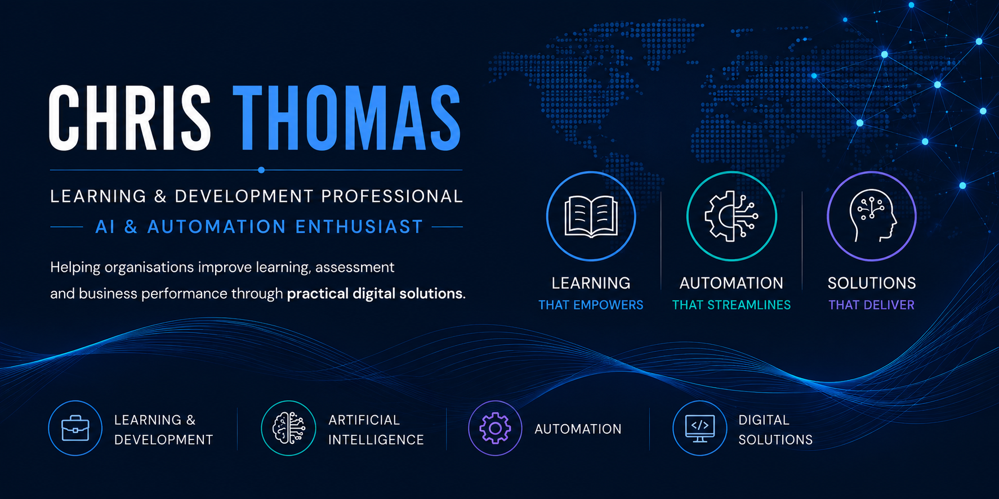

<p align="center">
  
</p>
<p align="center">

**Learning & Development professional, also applying Artificial Intelligence, automation and software development to create practical, user-focused digital solutions.**

</p>

---
---


# About Me

I'm an experienced Learning & Development professional with over 15 years' experience designing, delivering and improving apprenticeship programmes across public and private sector organisations.

Alongside my professional career, I've developed practical skills in Artificial Intelligence, automation and software development through continuous learning, industry-recognised certifications and practical project work.

I'm currently building an AI-powered digital solutions project that combines my professional background with modern technologies to solve real-world challenges and improve learning, productivity and business performance.

---

# Skills I Am Developing

I'm currently developing skills in applying Artificial Intelligence and automation to solve practical Learning & Development challenges, through hands-on software development.

Current areas of work include:

- AI-powered digital solutions
- Workflow automation
- Full-stack web development
- Python applications
- Continuous professional development

---

# Career Journey

```text
Learning & Development
            │
            ▼
Digital Learning
            │
            ▼
Artificial Intelligence (CPD)
            │
            ▼
Automation (CPD)
            │
            ▼
Software Development (CPD)
            │
            ▼
AI-Powered Digital Solutions (CPD)
```

---

# Professional Expertise

- Learning & Development
- Apprenticeship Delivery
- Skills Coaching
- Curriculum Design
- Learner Support
- Stakeholder Engagement
- Quality Improvement
- Assessment Preparation
- Project Management
- Digital Learning

---

# Technical Skills

### Development


### AI and Automation


With:
- Prompt Engineering
- AI-assisted Development
- Workflow Automation
- Generative AI

### Platforms & Tools


Including:
- Git
- Lovable

---

# Featured Technologies

### 🤖 Artificial Intelligence

- OpenAI
- Claude AI

---

# Professional Development

I'm committed to continuous professional development and practical learning.

Current areas of study include:

- Artificial Intelligence
- Automation
- Software Development
- Cloud Technologies
- API Integration
- Digital Product Development


## Professional Certifications

Continuous learning is an important part of my professional development. Alongside my experience in Learning & Development, I continue to expand my knowledge of Artificial Intelligence, automation and software development through recognised industry certifications and practical application.

<p align="center">
  
  
</p>

### Google Career Certificates

- 🎓 **Google AI Professional**  
  🔗 [View Certificate](https://coursera.org/verify/profession
al-cert/O9EXYHHIYTL9)

- 🎓 **Google Data Analytics**  
  🔗 [View Certificate](https://coursera.org/verify/profession
al-cert/SK9EIP7KYTEW)

---

# Professional Values

I believe technology should solve genuine problems.

Whether supporting learners, improving organisational performance or streamlining business processes, my aim is always to create practical, user-focused solutions that deliver measurable value.

I value continuous learning, thoughtful design, clear communication and building technology that has a positive impact on people.

---

# Connect

📧 Email

🌐 Portfolio
*(Coming soon)*

---

> **"Combining years of Learning & Development experience with emerging AI and automation technologies to create practical digital solutions that make a meaningful difference."**